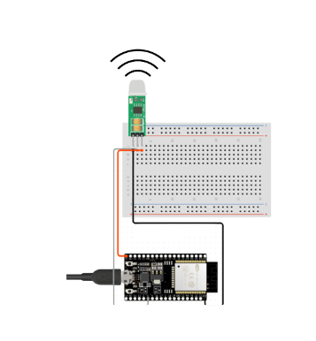
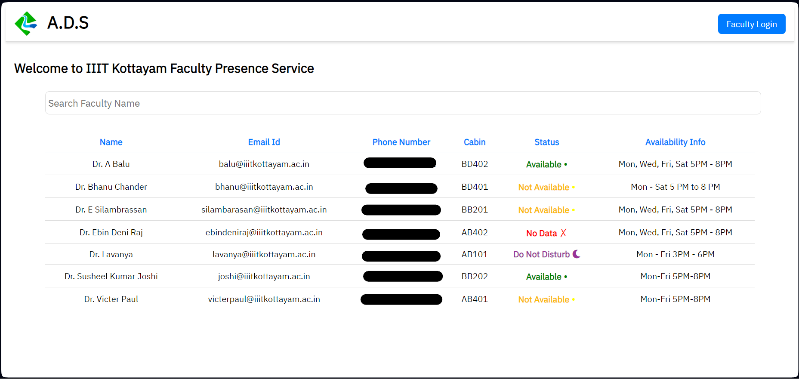

# ADS-IOT
## Authorised Detection System
"Empowering Secure Environments with Advanced Detection Technology"

Use Case: Faculty Presence Detection, Anomaly Detection.

Motivation:
- To tackle the challenge of efficiently determining faculty presence.
- Reduce dependence on manual searches or phone calls for verifying faculty locations.
- Improve the overall efficiency of interactions between faculty and students.
- To ensure physical Security.

Novelty:
- As this module and server both work on the same network, this application doesn’t need Internet connectivity to run.
- Besides simplifying faculty member location, it functions as an anomaly detection system.
- Prompt notification to faculty authorities in case of unauthorized entry.
- Dual functionality sets ADS apart, ensuring both efficiency and campus security.

Hardware Components: 
1. ESP32 DEVKIT C
2. PIR HC-SR505

Software Tech Stack:
1. Flask - Backend
2. HTML, CSS, JS - Frontend
3. SQLite3 - Database

### Pictures

#### Hardware - Circuit

#### Software - Portal

